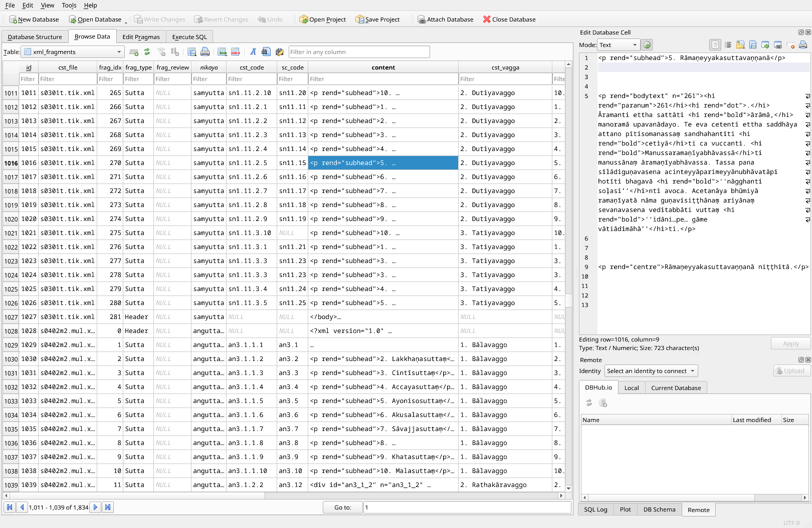

# Tipitaka-xml Parser

A cli tool which attempts to parse [tipitaka-xml](https://github.com/VipassanaTech/tipitaka-xml) `romn/` xml files into suttas in an sqlite database.

⚠️ **Warning** ⚠️ **Work-In-Progress.** The parser produces some okay results for
some nikāyas (tested with the xml in [tests/data/](tests/data/)), but it still
can't handle many cases due to the irregular structure of the xml files.

There is still room for improving the parser results with with more code to
handle various cases.

After that, manual checking and correction will be necessary, I am thinking a
small web GUI could help to quickly move through the rows, typing in missing
values and adjusting xml fragment boundaries.

## Use-case

The intended result would be an sqlite database which sutta reader apps can use
to import CST4 suttas (mūla, aṭṭhakathā, ṭīkā) with SuttaCentral reference codes
where possible.

[Simsapa Dhamma Reader](https://github.com/simsapa/simsapa-ng) uses it to bootstrap the CST4 suttas into its database.

The cli tool produces an sqlite database. The `xml_fragments` table contains
suttas with their metadata, the xml slice and its start- and end position in the
original xml file.

Thus the original xml files can be reconstructed from the `xml_fragments` rows.

The parsed metadata includes the `cst_code (sn5.12.2.1)` (CST4 numbering) and
the corresponding `sc_code (sn56.11)`, which is the Wisdom Publications
numbering adopted by [SuttaCentral](https://suttacentral.net/).



## Example

It can be called directly on the `romn/*.xml` files of [tipitaka-xml](https://github.com/VipassanaTech/tipitaka-xml).
Note that these are in UTF-16 encoding.

There are test xml files in UTF-8 encoding in the `tests/data/` folder of this repo.

```
cargo run -- parse-tipitaka-xml --xml-file path/to/tipitaka-xml/romn/s0201m.mul.xml --fragments-db fragments.sqlite3
```

